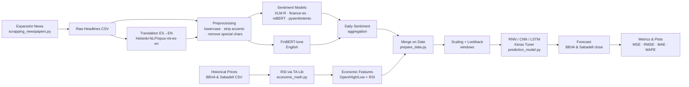

# 📈 Stock Prediction — BBVA & Banco Sabadell

> Forecasting the daily closing price of two Spanish banks by fusing **technical market data** with **multi-model news-sentiment analysis**, served to tunable **RNN / CNN / LSTM** deep-learning networks.

<p align="left">
  
  
  
  
  
</p>

---

## 🎯 Overview

This project predicts the next-day **closing price** (`Último`) of **BBVA** and **Banco Sabadell** simultaneously. The core hypothesis is that combining quantitative price signals with the *tone of the financial press* improves predictive power over price data alone.

To test this, the pipeline:

1. **Scrapes** Spanish financial news headlines (from *Expansión*) relevant for BBVA and Sabadell.
2. **Scores** each headline with **five different sentiment-analysis model families**, including one that operates on machine-translated English text.
3. **Merges** the daily-aggregated sentiment with historical OHLC price data enriched with the **RSI** technical indicator.
4. **Trains and tunes** three neural-network architectures (RNN, CNN, LSTM) to forecast both banks' closing prices at once.
5. **Evaluates** them with MSE, RMSE, MAE, MAPE, and walk-forward cross-validation.

The data window spans **2020-01-01 → 2025-10-31** (≈1,494 trading days and ≈3,690 headlines).

---

## ✨ Key Features

- **Multi-source feature fusion** — economic/technical indicators + news sentiment in a single feature matrix.
- **Five sentiment model families** benchmarked against each other (multilingual, Spanish-finance-specific, and English-finance-specific).
- **Automatic Spanish→English translation** (MarianMT) so an English-only financial model (FinBERT) can be applied.
- **Multi-output regression** — a single model predicts BBVA *and* Sabadell closing prices together.
- **Hyperparameter optimization** via Keras Tuner (Bayesian Optimization, up to 50 trials per architecture).
- **Walk-forward cross-validation** designed for time-series (no future leakage).
- **Optional Apache Druid** backend for serving the news dataset.

---

## 🏗️ Pipeline Architecture



---

## 📁 Project Structure

| File | Role |
|------|------|
| `scrapping_newspapers.py` | Scrapes financial headlines from *Expansión* (BeautifulSoup + requests) with date parsing and pagination. |
| `test_sentiment_analysis.py` | Text-cleaning utilities (accent/special-char removal, stemming, lemmatization), MarianMT translation, and a **benchmark harness** that scores the sentiment models and reports accuracy, F1, and confusion matrices. |
| `prepare_data.py` | Applies all five sentiment models to headlines, computes RSI, and merges economic + sentiment data into the training frame. |
| `economic_math.py` | RSI calculation helper built on **TA-Lib**. |
| `prediction_model.py` | Builds, tunes, trains and evaluates the **RNN / CNN / LSTM** models; produces metrics and matplotlib comparison plots. |
| `data/` | All datasets (prices, raw headlines, translations, and precomputed sentiment scores). |

### `data/` contents

| Dataset | Description |
|---------|-------------|
| `HistoricDataBBVA_01-01-20_31-10-25.csv` | BBVA daily OHLC + volume + % change. |
| `HistoricDataSabadell_01-01-20_31-10-25.csv` | Banco Sabadell daily OHLC + volume + % change. |
| `news_data_2020-01-01_2025-10-31.csv` | Raw scraped headlines with dates. |
| `headlines_traducciones.csv` | Headlines paired with their English translations. |
| `new_headlines_sentiment.csv` | Headlines + translations + sentiment scores from every model. |

---

## 🧠 Sentiment Models

Each headline is scored by several models so their contributions can be compared as features:

| Model | Hugging Face ID | Language | Output |
|-------|-----------------|----------|--------|
| **XLM-R** | `cardiffnlp/twitter-xlm-roberta-base-sentiment` | Multilingual (ES) | positive / neutral / negative |
| **Finance-Sentiment-ES** | `bardsai/finance-sentiment-es-base` | Spanish (finance) | positive / neutral / negative |
| **mBERT** | `nlptown/bert-base-multilingual-uncased-sentiment` | Multilingual | 1–5 star scores |
| **FinBERT-tone** | `yiyanghkust/finbert-tone` | English (finance) | positive / neutral / negative |
| **pysentimiento** | `robertuito` (via `pysentimiento`) | Spanish | POS / NEU / NEG |

> Spanish headlines are machine-translated to English (`Helsinki-NLP/opus-mt-es-en`) so the English-only **FinBERT** model can be applied to the same news.

---

## 🤖 Forecasting Models

Three architectures are defined as Keras-Tuner `HyperModel`s and searched with **Bayesian Optimization** (`max_trials=50`):

- **RNN** — stacked `SimpleRNN` layers + dropout + (optional dense and dropout) + dense head.
- **CNN** — stacked `Conv1D` + `MaxPooling1D` + dropout + (optional dense and dropout), + dense head.
- **LSTM** — stacked `LSTM` layers + dropout + (optional dense and dropout) + dense head.

**Shared configuration**

- **Lookback window:** 3 time steps
- **Output:** `Dense(2)` → predicts BBVA *and* Sabadell close together
- **Scaling:** `MinMaxScaler` or `RobustScaler`
- **Loss / metric:** Mean Squared Error / MAE
- **Tuned hyperparameters:** layer counts, units/filters, activations, dropout, learning rate `{1e-2, 1e-3, 1e-4}`, batch size `{16, 32, 64}`
- **Callbacks:** `ModelCheckpoint` (best-only) + `EarlyStopping` (patience 10)
- **Split:** last 20 % held out as test (chronological — no shuffling); validation taken from the tail of the training set.

---

## 📊 Evaluation

Models are scored on both training and test sets with:

- **MSE**, **RMSE**, **MAE**, **MAPE**
- A custom **accuracy** score: `100 − (RMSE / mean(actual) × 100)`
- **Walk-forward cross-validation** (`n_splits = 5`) that grows the training window over time to avoid look-ahead bias.

Results are visualized with matplotlib (actual vs. predicted closing-price curves for each bank).

---

## 🚀 Getting Started

### Prerequisites

- Python 3.x
- **TA-Lib** — requires the native C library before the Python wrapper:
  ```bash
  # Debian/Ubuntu
  sudo apt-get install ta-lib
  # macOS
  brew install ta-lib
  ```

### Installation

```bash
git clone https://github.com/jaime999/Stock_prediction.git
cd Stock_prediction

pip install pandas numpy scikit-learn matplotlib scipy \
            tensorflow keras keras-tuner TA-Lib \
            transformers torch pysentimiento \
            beautifulsoup4 requests spacy stanza nltk pydruid
```

> Some preprocessing options additionally download NLTK / spaCy / Stanza Spanish resources on first run.

---

## ⚠️ Notes & Limitations

- Code comments, dataset column names, and printed output are in **Spanish** (e.g. `Último` = close, `Apertura` = open, `Máximo` = high, `Mínimo` = low, `Fecha` = date).
- Several training/plotting blocks are commented out in `prediction_model.py` — uncomment the relevant `tuner.search` / `model.fit` lines to actually run a search rather than only loading a saved checkpoint.
- This is a **research / educational** project. **It is not financial advice and should not be used for real trading decisions.**

---

## 📜 License

_No license file is currently included. Add one (e.g. MIT) to clarify reuse terms._

## 👤 Author

Created by [**@jaime999**](https://github.com/jaime999).
